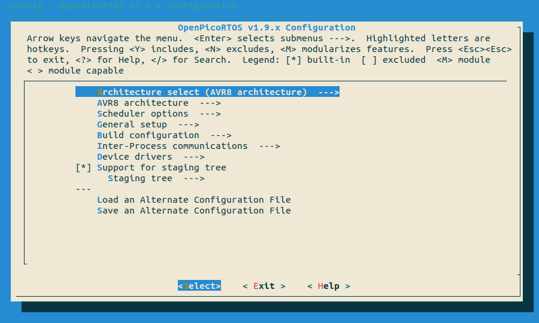

# OpenPicoRTOS [](https://img.shields.io) [](https://img.shields.io)

Very small, safe, lightning fast, yet portable preemptive RTOS with SMP & MPU support.

## Quick Presentation

picoRTOS is a small hard RTOS with as little overhead as humanly possible.

## Table of contents

  1. [Book of requirements](#book-of-requirements)
  1. [Features](#features)
  1. [Supported architectures](#supported-architectures)
  1. [Featured devices](#featured-devices)
  1. [How to use](#how-to-use)
  1. [Integration in your workflow](#integration-in-your-workflow)
  1. [Staging tree](#staging-tree)
  1. [Featured demos](#featured-demos)

## Book of requirements

OpenPicoRTOS has been designed with these requirements in mind:
  - [Compliance with "The Power Of 10" from the NASA/JPL](CODING_RULES.md)
  - Compliance with MISRA C 2012
  - Limited use of inline assembly:
    - Inline assembly should be side-effect free (no use or modification of variables)
    - Inline assembly can be safely removed from the static analysis
  - Smallest footprint possible
  - Fully static
  - Fully predictable
  - High portability
  - Lowest overhead possible
  - Support for memory protection (MPU)
  - Support for SMP
  - Less than 400 lines of code

[More information on how these requirements are satisfied](etc/Requirements.md)

## Features

### Schedulers

OpenPicoRTOS provides 3 selectable schedulers:

 - picoRTOS (default)
 - picoRTOS-SMP (for multi-core platforms)
 - picoRTOS-lite (for smaller platforms)

These 3 schedulers are compatible, with some extensions for **SMP** (core attribution) &
some limitations for **lite** (no MPU, no statistics, no shared priorities).

The default policy is *fixed priority preemptive scheduling*, but *round-robin* through shared
priorities is supported, as well as some form of *FIFO scheduling*.

[More information on OpenPicoRTOS scheduler here](docs/SCHEDULERS.md)

### Memory protection

picoRTOS offers MPU support for severals platforms, including ARM Cortex-M & PowerPC E200 series.

This feature separates between user & kernel space as well as between tasks.

[More information on OpenPicoRTOS memory protection here](docs/MEMORY_MAP.md)

### Devices drivers

OpenPicoRTOS provides a variety of devices drivers and an associated hardware abstraction
layer.

These drivers can be selected for compilation using the [configuration interface](#how-to-use).

[More information on OpenPicoRTOS HAL here](docs/HAL_API.md)

### Interrupts

OpenpicoRTOS provides support for contextual interrupts. Some platforms are better supported
than others.

In any case, this feature should be used with care, as interrupts tend to destroy the real-time
part in "RTOS".

[Check the API for more info](#api)

### Inter-processus communications

The following IPCs are provided:

 - futexes (require `arch_test_and_set()`)
 - re-entrant mutexes (require `arch_compare_and_swap()`)
 - conditions (require mutexes)
 - queues (requires futexes)

[More information on OpenPicoRTOS IPCs API here](docs/IPCs_API.md)

### SDK

OpenPicoRTOS is also a SDK & can be used to build a firmware from scratch.<br>
See [How to use](#how-to-use)

### API

OpenPicoRTOS API is divided into 2 categories, *privileged API*, which can only be called
as supervisor & *unprivileged API*, that can be called as user.

OpenPicoRTOS will only enforce these permissions if you enable the MPU.

[More information on OpenPicoRTOS privileged API here](docs/PRIVILEGED_API.md)<br>
[More information on OpenPicoRTOS unprivileged API here](docs/UNPRIVILEGED_API.md)

## Supported architectures

### Single core

 - ARM Cortex-M0+
 - ARM Cortex-M3
 - ARM Cortex-M4/F
 - ARM Cortex-M7
 - Atmel ATMega Series
 - Atmel TinyAVR Series
 - Intel 8051 / MCS51
 - MIPS M51xx / PIC32Mx
 - NXP/Freescale HC08/S08
 - PowerPC e200z4
 - PowerPC e200z7
 - RISC-V RV32IMAC
 - RISC-V RV32EC
 - STMicroelectronics STM8
 - TI C2000 / c28x

### Multi-core SMP
 - PowerPC e200z4 SMP
 - PowerPC e200z7 SMP
 - RP2040 SMP

### Simulation

 - POSIX threads / Linux
 - WIN32 threads / Windows

## Featured devices

 - Atmel ATMega2560
 - Atmel ATMega328P
 - Atmel ATMega32u4
 - Atmel ATSAM3X8E
 - Atmel ATSAMD5x/E5x
 - Atmel ATtiny817
 - Atmel ATtiny414
 - Atmel ATtiny88
 - Atmel ATtiny1607
 - Atmel ATSAMV7x/E7x
 - Cypress CY7C6801xA / EZ-USB FX2
 - GigaDevice GD32VF103
 - LogicGreen LGT8F328P
 - Microchip PIC32MZ-EF
 - Nuvoton MS51 series
 - Nuvoton N76E003
 - NXP MC9S08PTxx series
 - NXP MPC574x series
 - NXP MPC577x series
 - Raspberry Pico RP2040
 - Renesas RA4M1
 - STC MCU STC12C5Axx series
 - STMicroelectronics STM32F10xxx series
 - STMicroelectronics STM32F401x series
 - STMicroelectronics STM32H743/750
 - STMicroelectronics STM8Sx03 series
 - Texas Instruments TMS320F2837xD
 - WCH CH32V003

## How to use

### Step1: Preparation of your project

To create a project compatible with OpenPicoRTOS you first need to add a specific kind of Makefile to your project.

[You can find a very basic template here](samples/Makefile.template)

### Step2: configuration of your project

Simply type:

    # make menuconfig



And configure your project according to your needs.
You can find a lot of examples in the demo directory.

### Step3: Compilation of your project

    # make

### Step4: Static analysis of your project

    # make staticcheck

or, alternatively:

    # make splint
    # make cppcheck

### Bonus: all availables targets

Using the template makefile automatically offers you access to a new set of targets for the OpenPicoRTOS build system,
directly in your project directory:

```
Cleaning targets:
  clean           - Remove most generated files but keep the config and
                    enough build support to build external modules
  mrproper        - Remove all generated files + config + various backup files
  distclean       - mrproper + remove editor backup and patch files

Configuration targets:
  config          - Update current config utilising a line-oriented program
  nconfig         - Update current config utilising a ncurses menu based program
  menuconfig      - Update current config utilising a menu based program
  xconfig         - Update current config utilising a QT based front-end
  gconfig         - Update current config utilising a GTK based front-end
  oldconfig       - Update current config utilising a provided .config as base
  localmodconfig  - Update current config disabling modules not loaded
  localyesconfig  - Update current config converting local mods to core
  silentoldconfig - Same as oldconfig, but quietly, additionally update deps
  defconfig       - New config with default from ARCH supplied defconfig
  savedefconfig   - Save current config as ./defconfig (minimal config)
  allnoconfig     - New config where all options are answered with no
  allyesconfig    - New config where all options are accepted with yes
  allmodconfig    - New config selecting modules when possible
  alldefconfig    - New config with all symbols set to default
  randconfig      - New config with random answer to all options
  listnewconfig   - List new options
  oldnoconfig     - Same as silentoldconfig but set new symbols to n (unset)

Other generic targets:
  all             - Build target

Test targets:
  check           - Run static analysis on all basic platforms + unit tests

Static analysis targets:
  splint          - Run splint -checks on the source code
  cppcheck        - Run cppcheck --enable=all on the source code
  staticcheck     - Run both previous checks

  make V=0|1 [targets] 0 => quiet build (default), 1 => verbose build

```

## Integration in your workflow

In order to make picoRTOS easy to integrate in your embedded standalone projects,
a new 'make deploy' target has been added.

This will deploy a minimalistic picoRTOS tree in your working directory, containing
only the files/drivers you need in order to build your project (except the linker files),
thus eliminating the potential dead code issue.

Here's the basic workflow:

    # cp path/to/picoRTOS/samples/Makefile.in Kbuild
    # make -f Kbuild menuconfig

Here you can configure your project according to your needs

    # make -f Kbuild deploy

This will create the corresponding picoRTOS tree & a picoRTOS/Makefile.in file you
can include in your own Makefile.

You can then add the Kbuild, tree, include/generated/config.h and even the .config in your
git/svn/other repository.

## Staging tree

Version 1.8 introduces the staging tree.

This tree contains code that builds & fits the book of requirements but could
not be tested for one reason or the other.

This code should be considered highly experimental until validation.

## Featured demos

Basic demo code is provided for the following boards:
  - Adafruit ItsyBitsy M4 Express
  - Arduino Due
  - Arduino Mega2560
  - Arduino Nano v3 + LGT8Fx clone (staging)
  - Arduino Uno
  - Arduino Uno R4 Minima
  - ATtiny817-Xplained Mini
  - ATtiny1607 Curiosity Nano
  - Curiosity 2.0 PIC32 MZ EF
  - DevEBox STC-C51
  - DevEBox STM32H7xx_M
  - Infineon EZ-USB FX2LP
  - Microchip SAME70 XPlained Ultra
  - MH-Tiny / MH-Tiny88 (staging)
  - Nuvoton N76E003 / MCU-E003
  - NXP Devkit MPC5748G (dual-core SMP)
  - NXP MPC5775E-EVB (dual-core SMP) (staging)
  - NXP S08PT60-EVK (staging)
  - Sipeed Longan Nano
  - STMicro STM32F103C8T6 development board (staging)
  - STMicro STM32F401RCT6 development board (staging)
  - STMicro STM8S003F3P3 development board (staging)
  - Texas Instruments Launchxl-f28379d
  - Raspberry Pi Pico (single core & SMP)
  - WCH CH32V003F4P6 eval board (staging)

A portability demo is available in demo/amigaball-lcd and works with the
following boards (+0.96" LCD):
  - Adafruit ItsyBitsy M4 Express
  - Sipeed Longan Nano
  - Texas Instruments Launchxl-f28379d
  - Raspberry Pi Pico SMP
  - DevEBox STM32H7xx_M / STM32H743VIT6
  - Arduino Mega2560

Links:
  - https://www.youtube.com/watch?v=XeARSjY81Tk
  - https://www.youtube.com/watch?v=Bh-oae4uF4Y
